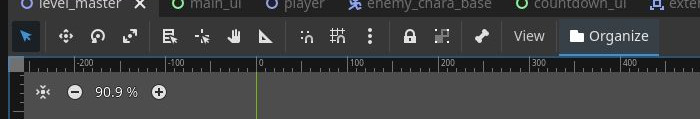
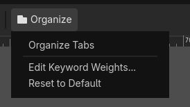
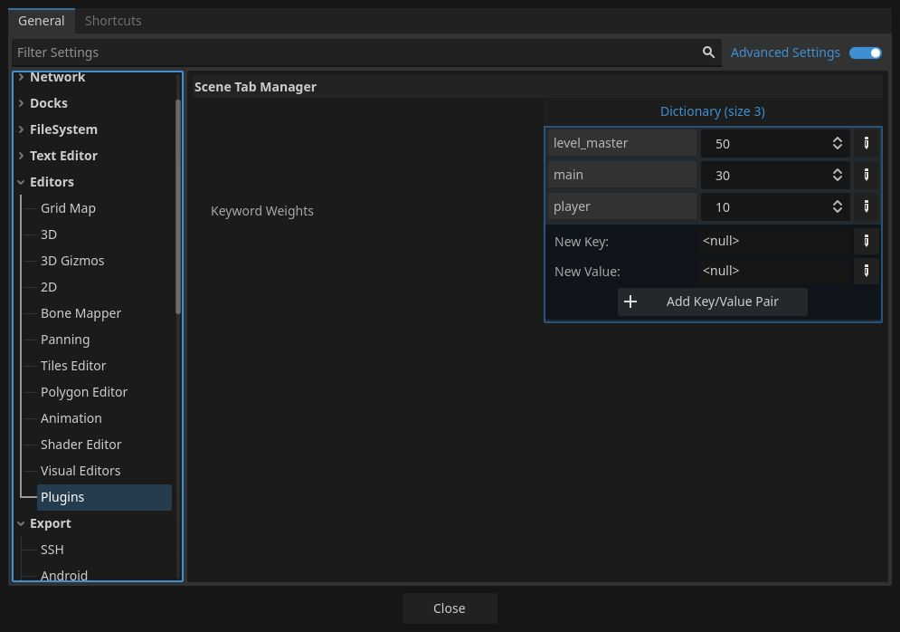

# Scene Tab Manager for Godot 4.x

[English](README.md)

**Scene Tab Manager** は、Godot エディタで開いているたくさんのシーンタブを、キーワードの優先度（重み）に合わせて自動で並べ替えてくれるプラグイン。

大きなプロジェクトで作業しているとメインメニューやプレイヤー、共通のベースシーンといった「よく使うシーン」が他のタブに埋もれてしまいがちである。
そこでこのプラグインを使えばそんな悩みもスッキリ解決。

## 主な機能

* **キーワードで並べ替え**: シーンのファイル名に含まれるキーワード（`Player`, `Main`, `Level` など）を見て、優先度の高い順に並べ替える。
* **カスタマイズも簡単**: **エディタ設定**、またはボタンの右クリックメニューからキーワードのスコアを自由に設定できる。
* **ワンクリック操作**: 2D/3D ビューポートのツールバーに追加される「整理（Organize）」ボタンを押すだけで、一瞬で整理が完了する。
* **右クリックメニュー**: ボタンを右クリックすることで、設定の編集やデフォルトへのリセットに素早くアクセスできる。
* **スマートなフォーカス復元**: 並べ替えが終わったあとは、もともと作業していたシーンにちゃんとフォーカスを戻してくれる。
* **シグナル接続のツールチップ表示**: **シーンツリー**のノードをホバーすると、そのノードのシグナル接続状況（送信/受信）をツールチップで一覧表示する。
* **クイックファイル特定 (Alt+クリック)**: **Alt** キーを押しながらタブやノード、インスペクターのリソースをクリックすると、そのファイルが **FileSystem** ドックのどこにあるか一発で表示される。

## インストール

1.  `addons/scene_tab_manager` フォルダを、自分のプロジェクトの `addons/` の中にコピーする。
2.  Godot エディタの **プロジェクト -> プロジェクト設定** を開く。
3.  **プラグイン** タブで **Scene Tab Manager** を **有効** にすればOK。

## 使い方

### 1. タブを整理する
エディタ上部のツールバーにある **Organize** ボタン（フォルダのアイコン）をクリック。

### 2. 設定へのクイックアクセス (右クリック)
**Organize** ボタンを右クリックすると、以下のオプションを含むコンテキストメニューが開く。

* **Organize Tabs**: 左クリックと同じ整理動作を実行。
* **Edit Keyword Weights...**: インスペクター上で直接重み設定を編集できる。エディタ設定ダイアログを開く手間が省ける。
* **Reset to Default**: すべてのキーワード設定を初期状態に戻す（確認ダイアログが表示される）。

### 3. 優先度を設定する
設定方法は2通り：
1.  **右クリックメニューから**: ボタンを右クリックし、**Edit Keyword Weights...** を選択。インスペクターに設定が表示される。
2.  **エディタ設定から**:
    * **エディタ -> エディタ設定** を開く。
    * **Editors -> Plugins -> Scene Tab Manager** セクションへ行く。
    * `Keyword Weights` 辞書を編集する。

#### 設定の詳細:
* **Key (String)**: 検索するキーワード（大文字小文字は区別しない）。
* **Value (Integer)**: 優先度スコア。数字が大きいほど左側に並ぶようになる。

#### 設定例:
| キーワード | スコア
| :--- | :---
| `title` | 50
| `level_base` | 30
| `player` | 10

### 4. クイックファイル特定
**Alt** キーを押しながら以下をクリックすると、FileSystem ドックでそのファイルが強調表示される。
* **シーンタブ**: Alt を押しながらタブを選択する。
* **シーンツリーのノード**: 保存されたシーン（インスタンス）なら、そのシーンファイルを表示する。
* **インスペクターのリソース**: テクスチャやスクリプト、マテリアルなどのプロパティをクリックする。

### 5. シグナル接続のツールチップ表示
**シーンツリー**ドックのノードにマウスを合わせると、そのノードの接続情報が即座に表示される。

* **Signals (Outgoing)**: このノードからどこへシグナルが飛んでいるかを表示。
* **Incoming**: どのノードからこのノードへシグナルが飛んできているかを表示。
* **表示内容の切り替え**:
    * **通常表示**: スクリプトが設定されたオブジェクト間の接続（主にユーザー定義のもの）のみを表示。
    * **詳細表示 (Ctrlキーを押しながらホバー)**: エンジン内部の接続や継承された接続を含む、すべての情報を表示。

---

## 技術的な話と制限

* エディタで**今開いている**タブだけがソートの対象になる。
* 並べ替えの途中で各シーンが一瞬だけアクティブになるが、終わったら元のシーンに戻る。
* タブがたくさんあっても安定して動くように、移動の間にほんの少し（0.05秒）だけ待ち時間を入れている。
* ツールチップの更新は最適化された間隔（0.1秒）で行われ、エディタのパフォーマンスへの影響を最小限に抑えている。

---

### ライセンス
MIT
