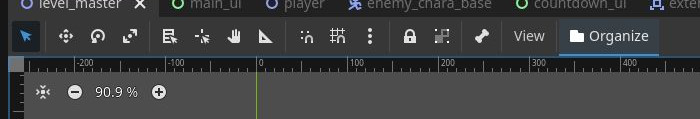
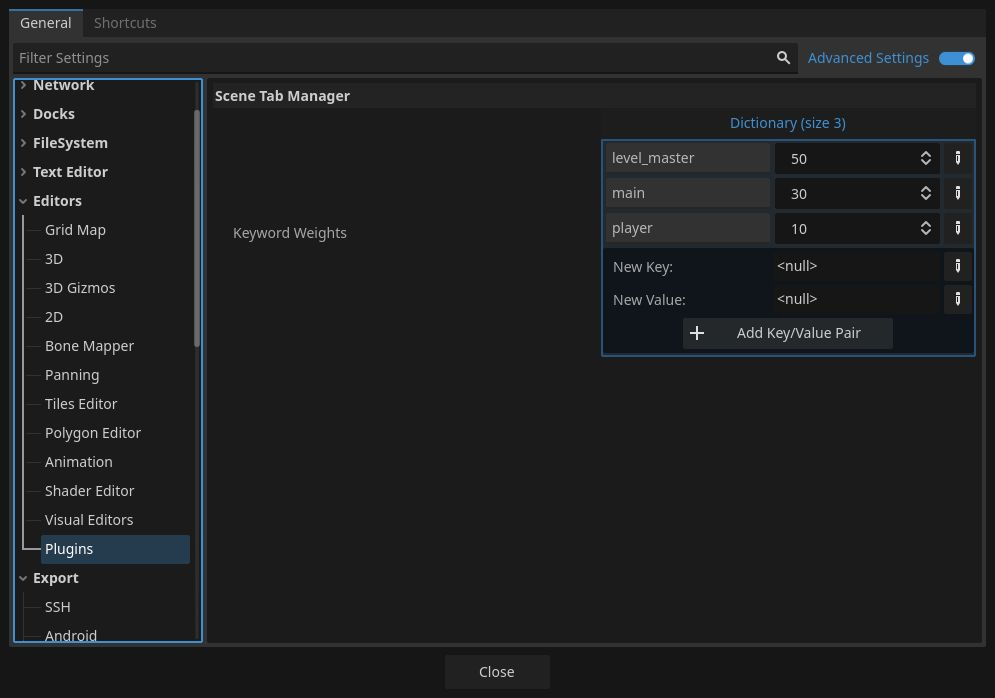

# Scene Tab Manager for Godot 4.x

**Scene Tab Manager** is an editor plugin that automatically organizes the numerous open scene tabs in the Godot Editor based on predefined keyword priorities (weights).

It solves the common issue in large projects where important scenes—such as the main menu, player, or common base levels—get buried under a sea of other open tabs.

## Key Features

* **Keyword-Based Sorting**: Calculates a priority score based on keywords in the scene's filename (e.g., `Player`, `Main`, `Level`) and sorts them in descending order.
* **Easy Customization**: Change keyword and score pairs directly from the **Editor Settings** to match your project's needs.
* **One-Click Operation**: Instantly organize your tabs by clicking the "Organize" button added to the 2D/3D viewport toolbar.
* **Smart Restoration**: Automatically returns focus to the scene you were originally working on after the sorting process is complete.

## Installation

1.  Copy the `addons/scene_tab_manager` directory into your own project's `addons/` directory.
2.  In the Godot Editor, navigate to **Project -> Project Settings**.
3.  Go to the **Plugins** tab and change the status of **Scene Tab Manager** to **Enabled**.

## Usage

### 1. Organizing Tabs
Click the **Organize** button (with the folder icon) located in the top toolbar of the editor (near the "View" or "Tool" menus).

### 2. Configuring Priorities
1.  Open **Editor -> Editor Settings**.
2.  Navigate to the **Editors -> Plugins -> Scene Tab Manager** section.
3.  Edit the `Keyword Weights` dictionary to set your preferred keywords and scores.
    * **Key (String)**: The keyword to search for (case-insensitive).
    * **Value (Integer)**: The priority score. Higher values will place the tab further to the left.

#### Default Setting Example:
| Keyword | Score
| :--- | :---
| `title` | 50
| `level_base` | 30
| `player` | 10

## Technical Details & Limitations

* This plugin only sorts scene tabs that are currently **open** in the editor.
* During the reorganization process, each scene is briefly set as active; however, the focus is restored to your original scene once finished.
* To ensure stability even with a large number of tabs, a tiny delay (0.05s) is applied between tab movements.

---

### License
This project is released under the MIT License.
